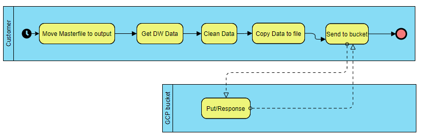

# DataEngineering-HeadCount

This is the HeadCount repository, the code in this module is being run in a EC2 linux instance, it establishes a connection to our Data Warehouse and extracts some information based on a query, once the data is clean and process its uploaded to a GCP Storage bucket.

The code is being executed every Thursday and triggered by a Cron Tab in the EC2 Linux (CentOS).

### BPMN Diagram


### Objective

> Develop a data pipeline for one of our leadership board to have the count of people in the org.
> Robust solution.

### Tech

List of technologies used for this module

* EC2 Linux (CentOS)
* Python 3.7 script
* Cloud Storage

### Local Testing

Requires [Python](https://docs.conda.io/en/latest/miniconda.html) v3.7+ to run.

Install the dependencies

```sh
$ cd DataEngineering-HeadCount
$ conda create -n venv python=3.7
$ conda activate venv
$ pip install -r requirements.txt
$ python main_test_locally.py
```
Note: To run locally add your database credentials (ETL/DBConn.py) and also the GCP IAM service account (.json) to (ETL/GeneralFunctions.py)

#### Building for source
if new lib added to the project update requirements.txt
```sh
$ pip freeze --local > requirements.txt
```

### Docker
GCP builds the container therefore the requirements.txt needs to be provided

```sh
FROM python:3.7-alpine
FROM python:3.7-slim-buster
WORKDIR /code
COPY requirements.txt requirements.txt
RUN pip install --no-cache-dir -r requirements.txt
COPY . .
CMD [ "python", "./main.py" ]
```
 
## Authors
* **Luis Enrique Fuentes Plata** - *2020-08-29*